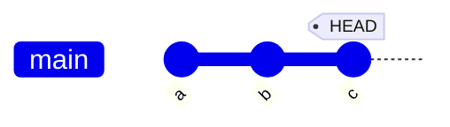
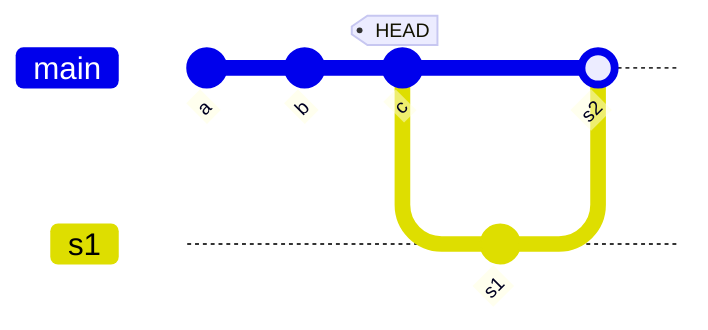

From

stash will create

s1 stores current state of Index.

s2 stores unstaged changes. Cannot use "add ." because that would include all untracked files, not modified files only.

To go back c from s2, run "reset s1", "reset --soft c"